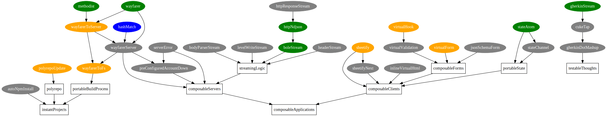

# plan
Project planning. Uses [graphviz]() to create project dependency graphs.

## Preview


## Install
```sh
$ git clone https://github.com/yoshuawuyts/plan
```

## Usage
```sh
$ bundle.sh
```
## License
[MIT](https://tldrlegal.com/license/mit-license)
