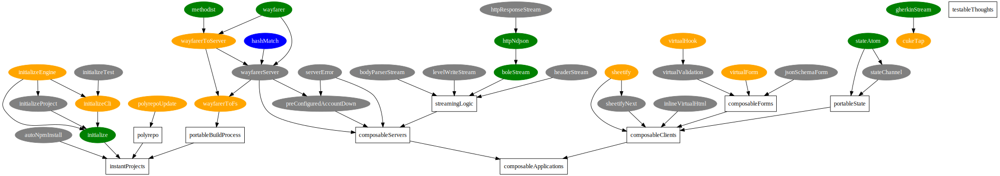

# plan
Open source is a job. Projects are dreamt up, created and maintained. Each
little piece is part of a larger whole. Just like with paid projects, whenever
a formal structure is lacking, an ad hoc variant will replace it. This is an
attempt to create an overview of the projects I've been working on, highlight
the goals behind them and formulate the relationships between them.

## Preview


## Install
```sh
$ git clone https://github.com/yoshuawuyts/plan
```

## Usage
Uses [graphviz]() to create project dependency graphs.
```sh
$ bundle.sh
```

## Introduction
We need better tools to become more productive. To develop means to repeat
yourself. Every year new frameworks pop up, conventions are abandoned and
monoliths created. Usually in the name of improvement. That's silly. While mad
scientists tinker away at the very edges of what was conceived to be possible,
others must take it upon themselves to improve the status quo or risk having
the industry as a whole forever strand on using the new era of XML, Python and
non-unix.

## Goals
- Create stand-alone components that work well together
- Implement patterns to deal with problems that are traditionally solved by
  frameworks (e.g. code generation, management tooling)
- Create streams

## Non-goals
- The goal isn't to create a framework
- I'm not alone in this, find existing projects where possible and build on top
  of them. Others are encouraged to take these ideas and implement parts of
  them.
- Marketing is not a goal; we cannot compete with large budgets (also doesn't
  interest me). Best we can hope for is adoption from knowledgeable people and
  hope for the best.

## Background

full context, why a solution needs to exist, what you hope to achieve. Provide
context for goals

## high-level design
graphs, charts, dependency graphs, relationship between views. Should be kept
brief because it is high-level. You look at it and understand what's going on.

## License
[MIT](https://tldrlegal.com/license/mit-license)
